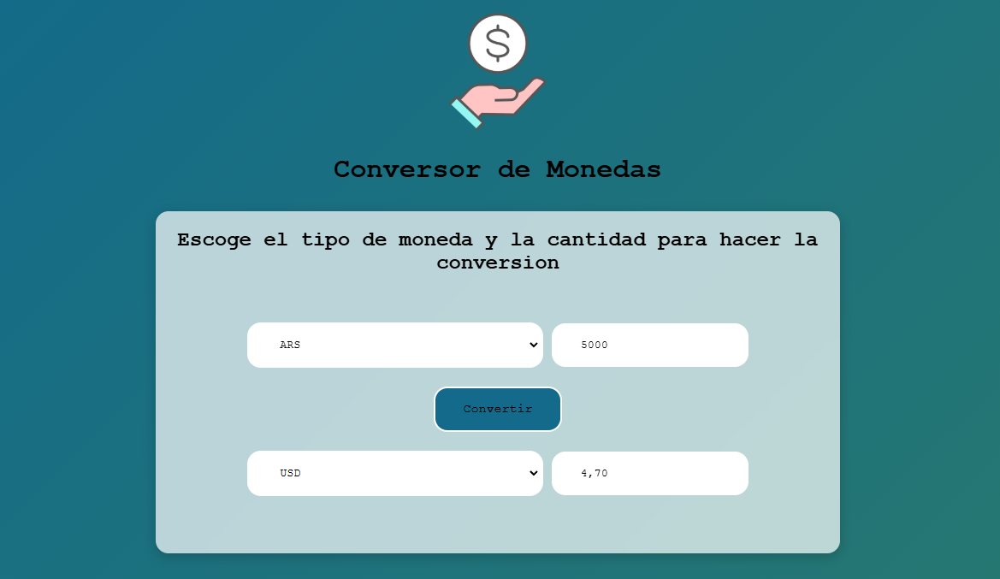

# Conversor de Monedas

<div style="text-align: center;">
  
</div>

Este proyecto es una aplicación web que permite consultar tasas de cambio de diferentes monedas en base a una API externa. Utiliza **Bootstrap** para el diseño responsivo y **jQuery** para manejar las interacciones y las peticiones a la API.

## 🚀 Tecnologías utilizadas

- HTML5
- CSS3
- [Bootstrap 5](https://getbootstrap.com/)
- [jQuery](https://jquery.com/)
- Fetch API para consumo de datos

## 📌 Requisitos previos

Asegúrate de tener instalado [Node.js](https://nodejs.org/) y `npm` para gestionar las dependencias.

## 📂 Instalación

1. Clona el repositorio:
   ```bash
   git clone https://github.com/tu-usuario/tu-repositorio.git
   ```
2. Accede a la carpeta del proyecto:
   ```bash
   cd tu-repositorio
   ```
3. Instala las dependencias:
   ```bash
   npm install
   ```

## ▶️ Uso

1. Abre el archivo `index.html` en tu navegador.
2. Selecciona una moneda base del menú desplegable.
3. Ingresa un valor valido para la moneda
4. Presiona el botón "Convertir" para obtener las tasas de cambio.

## 📜 Estructura del proyecto

```
📂 tu-repositorio/
├── 📂 node_modules/      # Dependencias de npm (no se suben a GitHub)
├── 📜 index.html         # Página principal
├── 📜 css/styles.css         # Estilos personalizados
├── 📜 src/main.js          # Lógica de la aplicación
├── 📜 package.json       # Configuración del proyecto y dependencias
├── 📜 package-lock.json  # Versiones exactas de las dependencias
└── 📜 .gitignore         # Archivos y carpetas a ignorar en Git
```

## 🛠️ Personalización

Si deseas modificar los estilos, edita `styles.css`.
Si quieres cambiar la lógica, revisa `script.js`.

## 📌 Notas importantes

- **No olvides ignorar `node_modules/`** en `.gitignore` para evitar subir archivos innecesarios.
- Si experimentas problemas al cargar Bootstrap desde `node_modules`, considera usar el **CDN**.